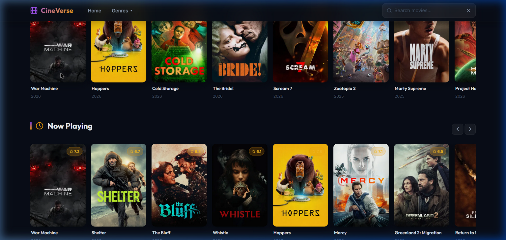
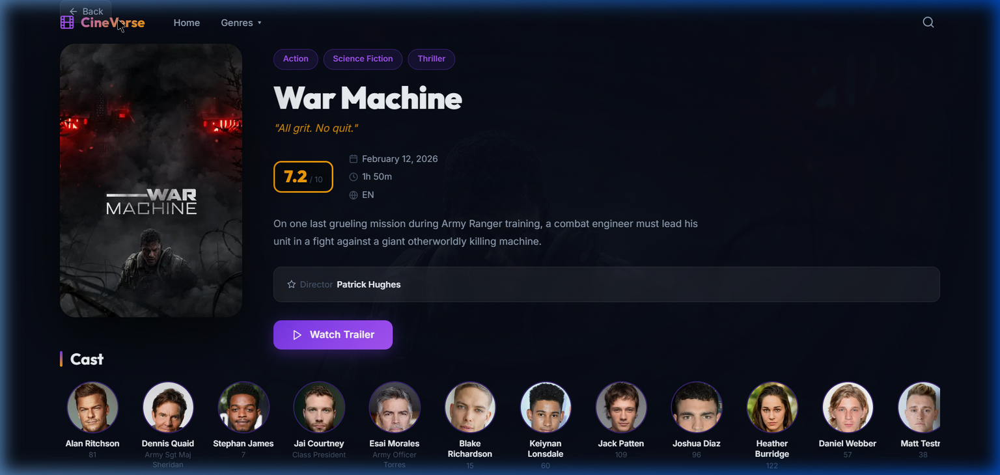
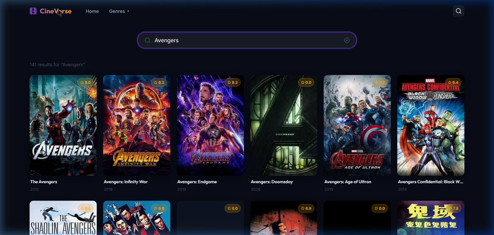

# 🍿 CineVerse



CineVerse is a visually stunning, responsive movie discovery application built with **React 18**, **TypeScript**, and the **TMDB (The Movie Database) API**. 

It features a premium "dark glassmorphism" design system, smooth micro-animations, and dynamic data fetching.

---

## ✨ Features

- **Hero Slider**: Auto-playing Swiper.js hero section featuring the week's trending movies with animated backdrop crossfades.
- **Dynamic Movie Rows**: Horizontal scrolling rows for *Trending*, *Now Playing*, *Popular*, and *Top Rated* movies.
- **Deep Search**: A URL-synced, debounced search experience that queries the TMDB database in real-time.
- **Rich Details Pages**: View high-resolution posters, budget/revenue financials, runtime, full cast lists, and embedded YouTube trailers.
- **Genre Browsing**: Filter thousands of movies by categories like *Action*, *Comedy*, or *Sci-Fi*.
- **Premium UI/UX**: Custom skeleton loading states, glassmorphism blur effects, custom scrollbars, and a fully mobile-responsive layout.

---

## 📸 Screenshots

### Movie Details & Trailers


### Real-time Search


---

## 🛠️ Technology Stack

- **Framework**: [React 18](https://react.dev/) + [Vite](https://vitejs.dev/)
- **Language**: [TypeScript](https://www.typescriptlang.org/)
- **Routing**: [React Router v6](https://reactrouter.com/)
- **Data Fetching**: [TanStack Query v5](https://tanstack.com/query/v5) (React Query)
- **API Requests**: [Axios](https://axios-http.com/)
- **Carousels**: [Swiper.js](https://swiperjs.com/)
- **Styling**: Vanilla CSS Modules (Variables, Flexbox/Grid, Glassmorphism)
- **Icons**: [React Icons](https://react-icons.github.io/react-icons/) (Feather icons)

---

## 🚀 Getting Started

To run this project locally, you will need a free API key from [The Movie Database (TMDB)](https://www.themoviedb.org/).

### 1. Clone the repository
```bash
git clone https://github.com/yourusername/cineverse.git
cd cineverse
```

### 2. Install dependencies
```bash
npm install
```

### 3. Setup Environment Variables
Create a `.env` file in the root of the project:
```env
VITE_TMDB_API_KEY=your_api_key_here
VITE_TMDB_ACCESS_TOKEN=your_read_access_token_here
VITE_TMDB_BASE_URL=https://api.themoviedb.org/3
VITE_TMDB_IMAGE_BASE_URL=https://image.tmdb.org/t/p
```

### 4. Run the development server
```bash
npm run dev
```
Open [http://localhost:5173](http://localhost:5173) in your browser.

---

## 🌐 Deployment
This project is completely free to host. See the [DEPLOYMENT.md](./DEPLOYMENT.md) guide for 1-click publishing instructions to Vercel or Netlify.

---
*Built with ❤️ using React and TMDB.*
